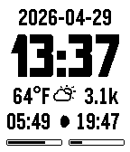
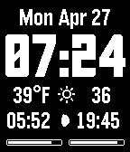
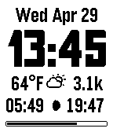
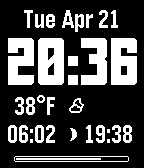
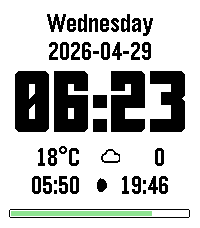
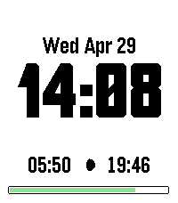
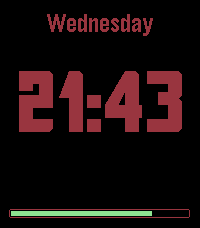

# BigInfo

A simple, clean Pebble watchface with a large, easy-to-read font. Displays the essentials at a glance, all configurable so you can hide what you don't need.

## Features

- **Large time display** -- tall bold font, 12 or 24-hour format
- **Custom color options** -- configurable background and text colors. Optionally switches colors based on sunrise/sunset
- **Date** -- year, day, month, date, and ISO 8601 date
- **Step counter** -- today's steps via Pebble Health
- **Weather** -- current temperature and conditions via [Open-Meteo](https://open-meteo.com/) (no API key required), with configurable temperature unit and update interval
- **Sunrise & sunset times** -- sun times from your location. Uses times from [Open-Meteo](https://open-meteo.com/) if weather is enabled, otherwise calculated on device
- **Moon phase** -- 29-phase moon icon and weather conditions use the [weather-icons](https://github.com/erikflowers/weather-icons) font
- **Watch battery meter** -- color-coded bar (green/yellow/red) with fallback to black and white
- **Phone battery meter** -- reports the connected phone's battery life from supported  devices
- **Bluetooth indicator** -- icon and optional vibration alert on disconnect
- **Hourly vibration** -- optional periodic pulse

## Want to try it?
Download on the Pebble store: https://apps.repebble.com/5eda31d774a34edeb1c87a39

## Supported Platforms

| Platform | Model |
|----------|-------|
| Aplite | Pebble, Pebble Steel |
| Basalt | Pebble Time, Pebble Time Steel |
| Diorite | Pebble 2 |
| Emery | Pebble Time 2 |
| Flint | Pebble 2 Duo |

## Screenshots

